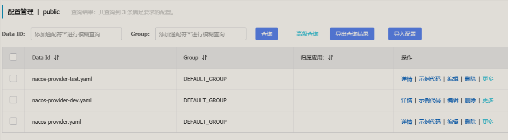
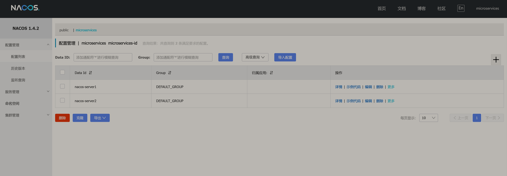
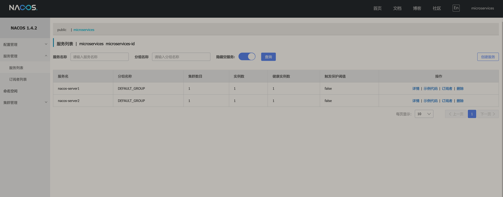

# feign-demo

### 1. feign使用
feign本质上就是一个封装好的注解式HTTP请求框架，微服务架构中使用feign很方便，需要添加下列依赖。

```
<dependency>
    <groupId>org.springframework.cloud</groupId>
    <artifactId>spring-cloud-starter-openfeign</artifactId>
</dependency>
```

调用方，也就是客户端client需要添加下列注解在启动类上。

```
@EnableFeignClients
```

在client中创建一个接口使用@FeignClient注解，设置名字和路径即可，它也支持直接继承别的接口，便于分组。

```
public interface UserService {
    @RequestMapping(value = "/find")
    User find();
}

@FeignClient(value = "server",path = "/user/server", fallbackFactory  = Fallback.class,configuration = FeignLogConfig.class)
public interface UserClient extends UserService{

    @RequestMapping(value = "/get")
    User get();
}
```

服务端server中提供对应地址的实现方法调用即可，本质上就是用feign简化调用的过程。所以上面客户端的path属性对应服务端中的路径名，value则是对应服务名。

```
@RestController()
@RequestMapping(value = "/user/server")
public class UserServer {
    private Logger logger = LoggerFactory.getLogger(UserServer.class);

    @RequestMapping(value = "")
    User index(){
        logger.info("call server index");
        return new User(0);
    }
}
```

feign自带封装好的日志输出，yml配置文件中先配置client接口的日志路径，再添加FeignLogConfig文件，配置输出的级别，默认是None不输出，还有另外三个级别。要使用configuration属性使用这个配置类，配置文件的优先级比Bean要高，修改feign.client.default-to-properties参数可以颠倒优先级。注意这个配置类添加@Configuration就会自动配置到全局范围。
```
logging.level.com.lp.client.UserClient: debug

@Bean
Logger.Level feignLoggerLevel(){
    return Logger.Level.BASIC;
}

@FeignClient(value = "server",path = "/user/server", fallbackFactory  = Fallback.class,configuration = FeignLogConfig.class)
```

还有自带的注解@SpringQueryMap，对象传参又不想用json格式，可以用这个注解。
```
@RequestMapping(value = "/findByAge")
User findByAge(@SpringQueryMap Param param);
```

还可以添加重试，和上面日志一样的配置，一样的导入即可。全局的话在配置类上加@Configuration注解。
```
@Bean
public Retryer feignRetryer() {
    return new Retryer.Default(100,SECONDS.toMillis(1),3);
}
```

---

### 2. Hystrix使用
feign里面已经集成了hystrix，不需要额外的依赖，需要下面配置打开，还可以配置超时时间。一旦打开，所有feign客户端都被包了一个熔断器。
```
feign:
  client:
    config:
# default表示，全局配置，单个配置使用feign的value值代替default
      default:
        connectTimeout: 2000
        readTimeout: 2000
  hystrix:
    enabled: true
hystrix:
  command:
# default表示，全局配置，单个配置使用feign的value值代替default
    default:
      execution:
        timeout:
          enabled: true
        isolation:
          thread:
            timeoutInMilliseconds: 1000
```

可以专门给一个feign客户端配置自己的断路器，直接新建一个FallbackFactory，或者新建一个Fallback都行。
```
@FeignClient(value = "server",path = "/user/server", fallbackFactory  = Fallback.class)
@FeignClient(value = "server",path = "/user/server", fallback  = Fallback2.class)
```

单独想关闭一个feign客户端的熔断器，配置下列的代码即可。
```
@Configuration
public class FooConfiguration {
    @Bean
    @Scope("prototype")
    public Feign.Builder feignBuilder() {
        return Feign.builder();
    }
}
```

Hystrix提供了一个监控仪表盘hystrix dashboard，其实就是一个单独的服务，在hystrix模块中添加下面的依赖，启动类使用@EnableHystrixDashboard注解，还需要在配置文件中配置代理允许访问的host列表。
```
<dependency>
    <groupId>org.springframework.boot</groupId>
    <artifactId>spring-boot-starter-actuator</artifactId>
</dependency>

<dependency>
    <groupId>org.springframework.cloud</groupId>
    <artifactId>spring-cloud-starter-netflix-hystrix-dashboard</artifactId>
</dependency>
```

本质上是提供代理去访问服务自带的监控，所以想要用仪表盘监控client项目，需要添加下面的监控依赖，配置文件中配置hystrix的访问页面。client还必须添加额外的hystrix依赖，使用额外的注解。最后先访问http://localhost:10004/hystrix，再通过界面代理访问 http://localhost:10002/actuator/hystrix.stream 。
```
<dependency>
    <groupId>org.springframework.boot</groupId>
    <artifactId>spring-boot-starter-actuator</artifactId>
</dependency>
```

也可以直接使用@HystrixCommand注解配置Hystrix，参数可以参考Hystrix在Github上官方提供的配置文档。

```
@HystrixCommand(fallbackMethod = "errorReturn",groupKey = "key1",commandKey = "key1"
    , commandProperties = {
    @HystrixProperty(name = "execution.isolation.thread.timeoutInMilliseconds", value = "10000"),
    @HystrixProperty(name = "circuitBreaker.requestVolumeThreshold", value = "1"),
    @HystrixProperty(name = "circuitBreaker.sleepWindowInMilliseconds", value = "10000"),
    @HystrixProperty(name = "circuitBreaker.errorThresholdPercentage",value = "1")
     }
)
```

---

### 3. Ribbon使用
Ribbon是一个可以实现负载均衡的组件，Feign默认会使用Ribbon，Ribbon客户端的名字会很Feign客户端名字一样。如果想要配置全局Ribbon，可以使用下列的配置。

CustomRule是选择策略，这里简单实现了一个策略，永远都只选择服务列表中第一个服务。
```
@RibbonClients(defaultConfiguration = DefaultRibbonConfig.class)
public class RibbonClientDefaultConfigurationTestsConfig {
}

@Configuration
public class DefaultRibbonConfig {
    @Bean
    public IRule ribbonRule() {
        return new CustomRule();
    }

}
```

分别启动两个Server，端口是10003和10005，观察日志可以看到每次请求，都会调用10005端口，默认是采用轮询。

```
2021-01-10 12:02:49.923  INFO 6664 --- [io-10002-exec-1] com.lp.client.CustomRule                 : invoke choose method, and serverList is [Half-PC.mshome.net:10003, Half-PC.mshome.net:10005].
2021-01-10 12:02:49.942 DEBUG 6664 --- [io-10002-exec-1] com.lp.client.UserClient                 : [UserClient#findText] <--- HTTP/1.1 200 (188ms)
2021-01-10 12:02:51.894 DEBUG 6664 --- [io-10002-exec-5] com.lp.client.UserClient                 : [UserClient#findText] ---> GET http://user-server/user/server/findText HTTP/1.1
2021-01-10 12:02:51.894  INFO 6664 --- [io-10002-exec-5] com.lp.client.CustomRule                 : invoke choose method, and serverList is [Half-PC.mshome.net:10003, Half-PC.mshome.net:10005].
2021-01-10 12:02:51.899 DEBUG 6664 --- [io-10002-exec-5] com.lp.client.UserClient                 : [UserClient#findText] <--- HTTP/1.1 200 (4ms)
2021-01-10 12:02:52.858 DEBUG 6664 --- [io-10002-exec-6] com.lp.client.UserClient                 : [UserClient#findText] ---> GET http://user-server/user/server/findText HTTP/1.1
2021-01-10 12:02:52.858  INFO 6664 --- [io-10002-exec-6] com.lp.client.CustomRule                 : invoke choose method, and serverList is [Half-PC.mshome.net:10003, Half-PC.mshome.net:10005].
2021-01-10 12:02:52.860 DEBUG 6664 --- [io-10002-exec-6] com.lp.client.UserClient                 : [UserClient#findText] <--- HTTP/1.1 200 (2ms)
```

更多配置可以参考[官网](https://cloud.spring.io/spring-cloud-netflix/multi/multi_spring-cloud-ribbon.html)。

---

### 4. Zipkin
Zipkin是一个分布式的链路追踪框架，是由Twitter开源的，还是比较值得信赖的，它可以记录分析在分布式服务中整个请求的链路耗时，以便分析瓶颈。Spring Cloud也集成了，只要添加依赖就可以使用，直接在父项目中添加下面两个依赖，所有的微服务都会记录追踪信息。

```
<dependency>
    <groupId>org.springframework.cloud</groupId>
    <artifactId>spring-cloud-starter-zipkin</artifactId>
</dependency>
<dependency>
    <groupId>org.springframework.cloud</groupId>
    <artifactId>spring-cloud-starter-sleuth</artifactId>
</dependency>
```

当然还需要添加一个可视化界面，官网有很多种方式，最简单的方式是使用Docker镜像，请求接口后就可以看到在每个服务上调用所花的时间。当然这只是一个最简单的例子，真实使用还可以使用消息队列，还可以持久化追踪信息。

```
docker pull openzipkin/zipkin
docker run --name zipkin -d -p 9411:9411 openzipkin/zipkin
```


---

### 5. Spring Cloud GateWay

Spring Cloud GateWay是一个网关框架，可以转发处理请求。使用起来也很简单，按照官方的文档说法，提供了许多各种各样的工厂来创造拦截器，比如根据请求方法类型，请求地址，请求头或者Cookie等等，所以既可以在代码中配置，也可以在配置文件中配置，详细配置都在Gateway项目下的配置文件中。

```
<dependency>
    <groupId>org.springframework.cloud</groupId>
    <artifactId>spring-cloud-starter-gateway</artifactId>
</dependency>
```

---

### 6. Nacos
Nacos是阿里的开源注册中心，可以选择是支持AP还是CP，除了像Eureka那样提供服务注册的功能之外，还自带管理界面，使用起来更加方便。

添加下面的依赖就可以使用，但是要注意，对版本是有要求的，Spring Cloud，Spring Cloud Alibaba和Nacos依赖的版本都是有要求的，详细的可以查看[官网](https://github.com/alibaba/spring-cloud-alibaba/wiki/%E7%89%88%E6%9C%AC%E8%AF%B4%E6%98%8E)，本项目是Spring Cloud Hoxton.SR9，Spring Cloud Alibaba 2.2.0.RELEASE和Nacos 2.1.0.RELEASE。
```
    <dependencies>
        <!-- 发现服务 -->
        <dependency>
            <groupId>com.alibaba.cloud</groupId>
            <artifactId>spring-cloud-starter-alibaba-nacos-discovery</artifactId>
            <version>2.1.0.RELEASE</version>
        </dependency>
    </dependencies>

    <dependencyManagement>
        <dependencies>
            <dependency>
                <groupId>com.alibaba.cloud</groupId>
                <artifactId>spring-cloud-alibaba-dependencies</artifactId>
                <version>2.2.0.RELEASE</version>
                <type>pom</type>
                <scope>import</scope>
            </dependency>
        </dependencies>
    </dependencyManagement>
```

启动类打个注解，访问 http://localhost:8848/nacos/index.html 就可以看到Nacos的控制台服务列表里面有数据了。总的来说很简单，功能也比较齐全，还自带管理界面，减少了运维成本，不过文档和例子比起Spring还是少了很多，质量也差了很多。
```
@EnableDiscoveryClient
```

除此之外Nacos还可以直接当作配置中心，需要添加下面的依赖。

```
<dependency>
    <groupId>com.alibaba.cloud</groupId>
    <artifactId>spring-cloud-starter-alibaba-nacos-config</artifactId>
    <version>2.1.0.RELEASE</version>
</dependency>
```

需要注意的就是如何正确匹配路径，Nacos既然可以作为配置中心那肯定会存储多个服务的配置文件，这就需要一套命名规范来匹配。首先是需要一个```bootstrap.yml```配置文件，这和使用Spring Cloud Config一样，bootstrap.yml是专门用来设置配置中心的一些属性，会比application.yml提前加载，并且会覆盖前者的属性。

Nacos的命名规则是下列这个格式，其中prefix对应spring.application.name的值，也可以通过配置spring.cloud.nacos.config.prefix来修改，中间的则是环境名称，例如dev等。最后一个则是对应的文件格式，比如yaml。也就是说Nacos的配置文件名字要和这个规则对的上才能找到对应的配置文件。

```
${prefix}-${spring.profiles.active}.${file-extension}
```

还有就是动态刷新配置了，Controller层需要添加@RefreshScope注解，使用以前正常的注入配置文件属性的方式即可。
```
@RefreshScope
public class ProviderController {
    ...

    @Value("${name:empty}")
    private String value;
}
```

下面是在Nacos中配置了三个配置文件，nacos-provider.yaml不配置profiles的情况，nacos-provider就是上面说的应用名，前两个则分别对应dev和test环境。
按照配置文件中激活不同的环境就会读取不同的配置文件。



Nacos中有命名空间的概念，可以理解为分组的意思，注册中心和配置中心都可以配置命名空间，如果是配置中心则一定要对应正确的命名空间才能读取到，如果是注册中心则一定是在同一个命名空间下才会请求到别的服务。

注意下面的两张图，在配置文件中填写的是命名空间的id才能生效，填写命名空间的名字是没效果的，如果命名空间不存在也可以注册成功，但是控制台不显示注册的服务，因为根本就没有对应的tag页面。


